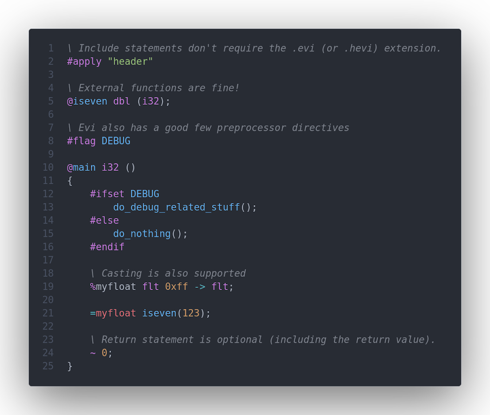
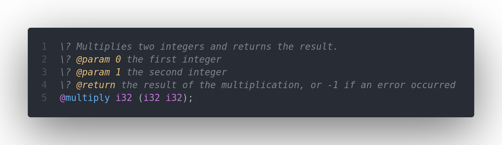

# Evi-Lang README

This is the extension for the Evi language. For more info go to [the github repository](https://github.com/SjVer/Evi-Lang)

## Features

- Syntax highlighting
- Autocomplete
- Suggestions
- Goto-definition
- Diagnostics
- Signature help
- Hover tools

## Screenshots

